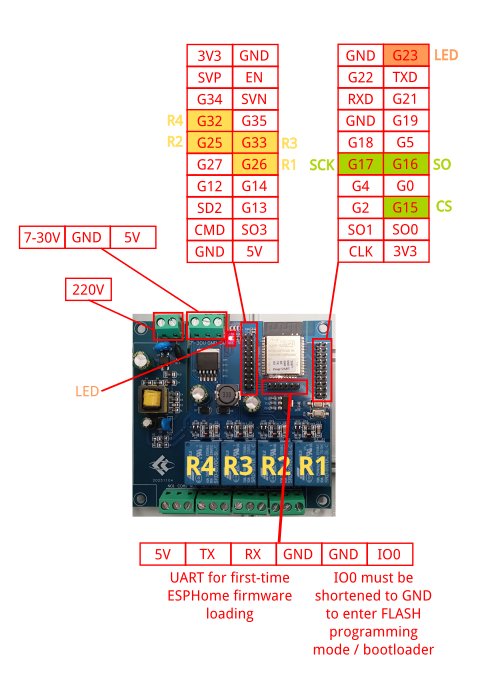

# esphome-fancoil-controller

ESPHome project to control a dumb fancoil unit

## Architecture Overview

## Electrical Considerations

In my case, the fancoil model is [Aermec FCX42P](./datasheets/Aermec_FCX_TECHNICAL_MANUAL_Eng.pdf), whose characteristics are:

* Electrical power:
    * Max power draw: 57W

* Cooling power:
    * High speed: 3.4kW
    * Medium speed: 2.78kW
    * Low speed: 2.31kW

## Board Details

## Labelling of the board

Since most likely your fancoil controller will be installed in some hidden box
and will stay around for a lot of time (many years hopefully), I suggest to provide 
some documentation reference for that.
A simple approach is to print a QR code pointing at this page.

Here you can find a QR code I produced with the optimal [miniQR code generator](https://mini-qr-code-generator.vercel.app/):

## Wiring Details

The fancoil model [Aermec FCX42P](./datasheets/Aermec_FCX_TECHNICAL_MANUAL_Eng.pdf) exposes a connector with 4 wires:

* Blue: earth wire
* Black: should be connected to LIVE wire to enable MAX speed 
* Brown: should be connected to LIVE wire to enable MEDIUM speed 
* Red: should be connected to LIVE wire to enable MIN speed 

