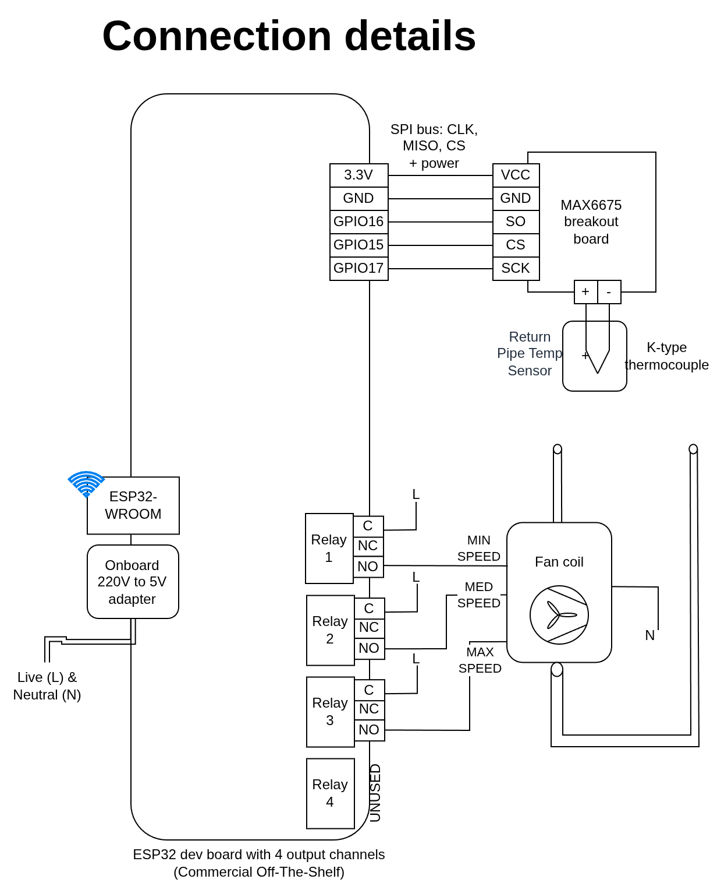

# esphome-fancoil-controller

ESPHome project to control a multi-speed fancoil unit.

## About Fancoils

Fancoil systems are basically just a fan connected to hot/chill water pipes 
that are used to either heat/chill the environment.
They do not heat or chill the water themselves, but they rather exchange heat
between the pipes and the air.
They can be:

* 2 pipes
* 4 pipes

fan coils.

They can be static speed or multi-speed.

## Project targets

This project is all about making HomeAssistant-friendly non-smart fancoil units and
supports multi-speed fancoils.

From this project perspective it doesn't matter if your fancoil is 2pipes or 4pipes.

This project is also agnostic about the voltage used by your fancoil (e.g. 120V US voltage or 240V EU voltage)
for the reason that it just activates relays exposing dry contacts.

## Architecture Overview

## Electrical Considerations

This project has been tested with the following fancoils:
* [Aermec FCX42P](./datasheets/Aermec_FCX_TECHNICAL_MANUAL_Eng.pdf), whose characteristics are:
    * Electrical power:
        * Max power draw: 57W
    * Cooling power:
        * High speed: 3.4kW
        * Medium speed: 2.78kW
        * Low speed: 2.31kW

## Board Details

## Connection Details

## Wiring Details

These notes are specific to the fancoil model [Aermec FCX42P](./datasheets/Aermec_FCX_TECHNICAL_MANUAL_Eng.pdf).
It exposes a connector with 4 wires:

* Blue: earth wire
* Black: should be connected to LIVE wire to enable MAX speed 
* Brown: should be connected to LIVE wire to enable MEDIUM speed 
* Red: should be connected to LIVE wire to enable MIN speed 

This makes it trivial connecting it to the relays as showsn in previous pictures above.

## Labelling of the board

Since most likely your fancoil controller will be installed in some hidden box
and will stay around for a lot of time (many years hopefully), I suggest to provide 
some documentation reference for that.
A simple approach is to print a QR code pointing at this page.

Here you can find a QR code I produced with the optimal [miniQR code generator](https://mini-qr-code-generator.vercel.app/):

