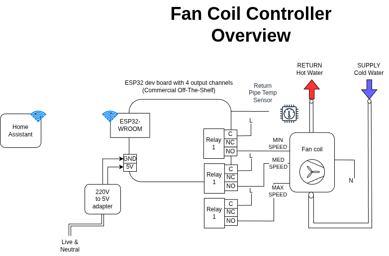
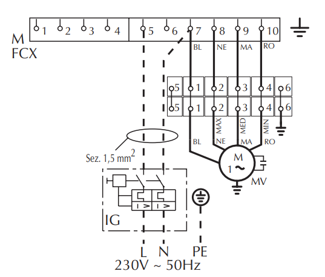

# esphome-fancoil-controller

ESPHome project to control a dumb fancoil unit

## Architecture Overview

## Electrical Considerations

In my case, the fancoil model is [Aermec FCX42P](./datasheets/Aermec_FCX_TECHNICAL_MANUAL_Eng.pdf), whose characteristics are:

* Electrical power:
    * Max power draw: 57W

* Cooling power:
    * High speed: 3.4kW
    * Medium speed: 2.78kW
    * Low speed: 2.31kW

